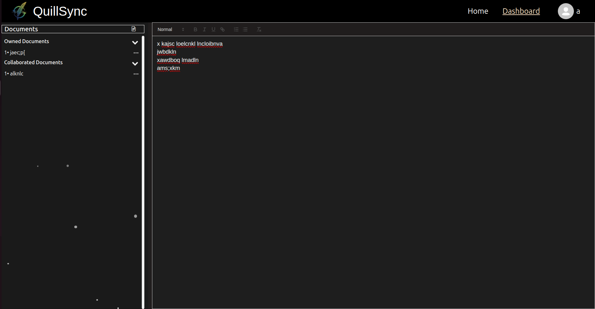

# QuillSync 🖊️

QuillSync is a **real-time collaborative document editor**, similar in spirit to Google Docs, built from scratch with modern web technologies. It allows multiple users to create, edit, and collaborate on documents simultaneously, with all changes instantly synchronized across clients.

---

## 🚀 Features

- **Real-time collaboration** powered by [Yjs](https://yjs.dev/) and WebSockets.  
- **Document persistence** in MongoDB – edits are saved incrementally and can be resumed later.  
- **Authentication & Authorization** with JWT: secure login, ownership, and collaborator roles.  
- **Collaborator Management** – share docs with others while maintaining permissions.  
- **Live Cursor Presence** – see collaborators’ cursors with unique colors in real time.  
- **Dashboard** separating **Owned** vs **Collaborator** documents.  
- **Minimal, responsive UI** built with React + Bootstrap.  
- **Deployed** frontend and backend on Render with HTTPS + WSS support.  

---

## 🏗️ Tech Stack

**Frontend**  
- React + Bootstrap  
- Quill.js (rich text editor)  
- Context API + Custom Hooks  

**Backend**  
- Node.js + Express  
- MongoDB + Mongoose  
- JWT Authentication  
- Yjs + WebSockets (CRDTs for conflict-free editing)  

**Deployment**  
- Render (Frontend + Backend)  

---

## 📂 Project Structure

```
/client      -> React frontend (components, pages, hooks, context)
/server      -> Express backend (routes, controllers, services, utils)
```

---

## ⚙️ How It Works

1. User logs in → JWT issued.  
2. User creates a new document or opens an existing one.  
3. Changes are broadcast in **real-time** via WebSockets using Yjs CRDTs.  
4. The document state is **persisted** in MongoDB so you can close and return later.  
5. Collaborators instantly see edits, cursor positions, and updates.  

---

## 📸 Screenshots (Optional)




---

## 🔮 Future Enhancements

- AI-powered document summarization  
- Version history & rollback  
- Offline editing with later synchronization  
- Dockerization + CI/CD pipeline  
- Unit & Integration testing with Jest  

---

## 📦 Installation

1. Clone the repository:
   ```bash
   git clone https://github.com/KunalVChoudhary/QUILLSYNC.git
   cd QuillSync
   ```

2. Install dependencies:
   ```bash
   cd client && npm install
   cd ../server && npm install
   ```

3. Add environment variables in server app (`.env`):
   ```
   MONGO_URI=your_mongo_connection_string
   CLIENT_URL=your_react_app_url
   JWT_SECRET=your_jwt_secret
   COOKIE_PARSER_SECRET_KEY=your_cookie_parser_secret
   PORT=your_port_number
   ```

4. Add environment variables in client app (`.env`):
   ```
   VITE_API_URL=your_express_server_url
   VITE_WS_URL=your_websocket_server_url
   ```

5. Start the QUILLSYNC app:
   ```bash
   npm start
   ```

---

## ⚖️ License

Distributed under the MIT License. See [LICENSE](LICENSE) for more information.

---

## ✍️ Author

* GitHub: [@KunalVChoudhary](https://github.com/KunalVChoudhary)
* Email: [imkunalvchoudhary@gmail.com](mailto:imkunalvchoudhary@gmail.com)
* LinkedIn: [kunal-vijayshree-choudhary](https://www.linkedin.com/in/kunal-vijayshree-choudhary)
